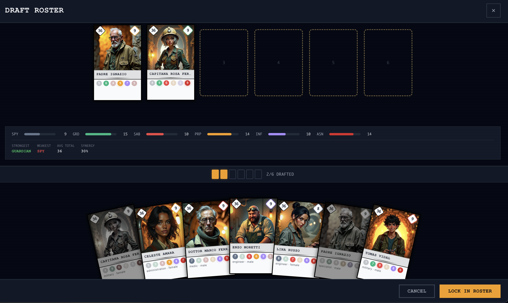
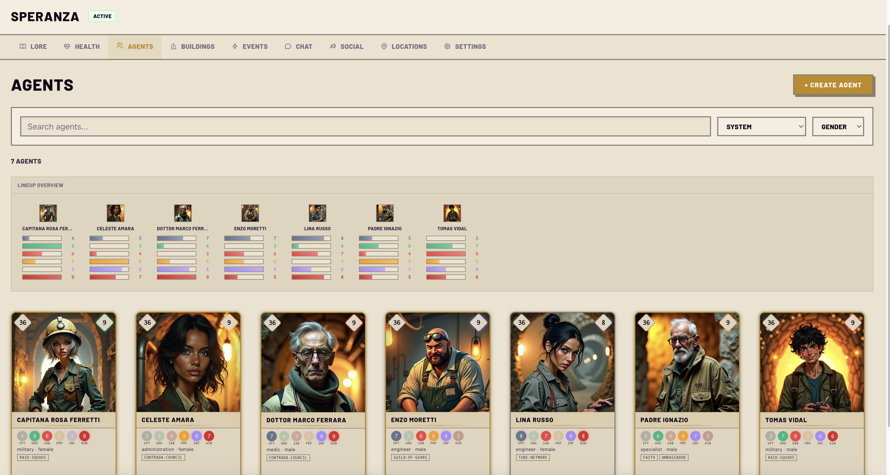
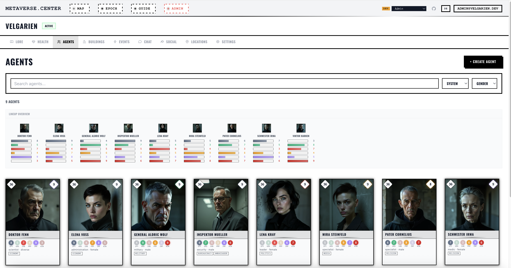
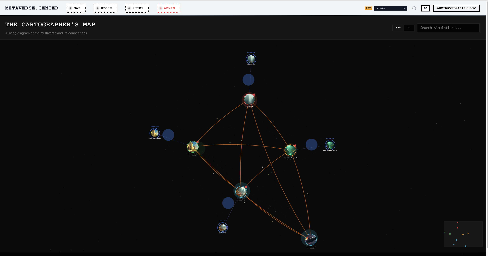
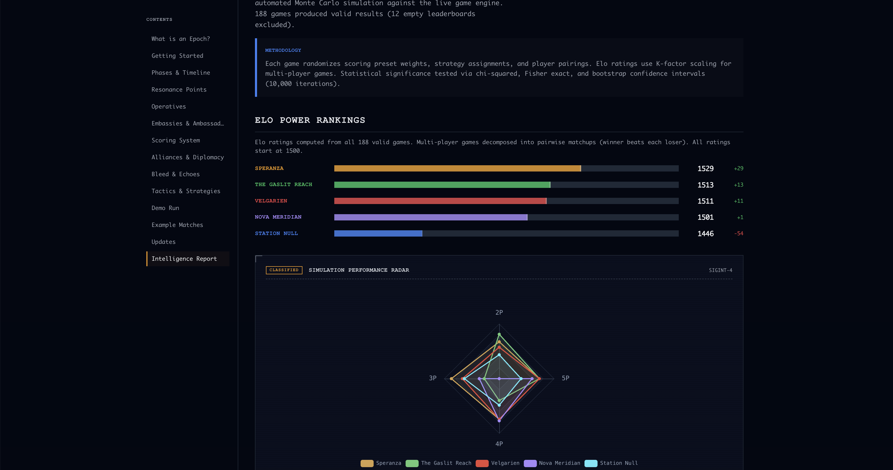

# metaverse.center

**Worlds collide. One fracture. A multiplayer worldbuilding platform where literary simulations compete, bleed into each other, and evolve.**

[](https://python.org)
[](https://typescriptlang.org)
[](https://lit.dev)
[](https://fastapi.tiangolo.com)
[](https://supabase.com)

> **Live:** [metaverse.center](https://metaverse.center) &mdash; anonymous browsing, no account required

---

## What Is This?

metaverse.center is a multiplayer worldbuilding platform where users create and manage literary simulations &mdash; each a distinct fictional world with its own agents, buildings, locations, events, and political dynamics. The platform ships with five richly detailed flagship worlds, but any user can forge new simulations with custom lore, themes, and entity hierarchies. Players shape their worlds through AI-assisted content generation and compete in **Epochs**: structured PvP campaigns where operatives are deployed, alliances form and fracture, and scoring spans five strategic dimensions.

A **cross-simulation diplomacy layer** connects worlds through embassies, ambassadors carry influence across borders, and "Event Echoes" bleed narrative consequences from one simulation into another. A force-directed **Cartographer's Map** visualizes the entire multiverse &mdash; simulation nodes, diplomatic connections, active game instances, operative trails, and real-time battle feeds.

Every number tells a story. Every story changes a number. Agent aptitudes shape operative success probabilities. Zone stability degrades under sabotage. Embassy effectiveness drops when infiltrators compromise diplomatic channels. The game balance is calibrated through deterministic simulation of hundreds of epoch matches, with statistical analysis driving each tuning pass.

The entire platform is bilingual (English/German), fully themed per-simulation with WCAG 2.1 AA contrast validation, and browsable without authentication via a public-first architecture.

---

## Screenshots

**Draft Roster** — Pre-match deckbuilding phase. Players select agents from a fanned card hand into deployment slots. The stats bar tracks cumulative aptitude totals across all six operative types (SPY, GRD, SAB, PRP, INF, ASN), strongest/weakest analysis, and team synergy. Pip counter shows 2/6 slots filled. "Lock In Roster" commits the selection.



*Speranza — post-apocalyptic survival simulation (warm parchment theme)*

**Buildings** — TCG card grid with AI-generated art, capacity stat gems, security dot indicators, type/condition badges, and embassy markers. Each card is a tactile 5:7 collectible with 3D tilt and light reflection on hover.


**Agents** — Lineup Overview strip (mini portraits with 6-row aptitude bar charts for at-a-glance team comparison) above the full agent card grid. Cards display AI portraits, color-coded aptitude pips per operative type, profession/gender subtitles, and rarity-driven border treatments.



*Velgarien — brutalist dystopia simulation (dark concrete theme)*

**Agents** — The same card system in Velgarien's dark theme: 9 agents with AI portraits, color-coded aptitude pips, profession/system badges, and the Lineup Overview strip for cross-agent aptitude comparison. Ambassador badges visible on Inspektor Mueller.



**Cartographer's Map** — Force-directed multiverse graph showing simulations as nodes with diplomatic connections (orange embassy links), energy pulses along edges, starfield background, and a minimap viewport. Supports 2D SVG and WebGL 3D rendering modes with search, zoom-to-cluster, and 30-second auto-refresh during active epochs. The graph grows dynamically as users create new simulations.



**Intelligence Report** — How-to-Play guide section with Elo power rankings across the flagship simulations (188 Monte Carlo games), methodology callout, and interactive Apache ECharts radar chart comparing simulation performance across 2P/3P/4P/5P player counts. Dark military-console aesthetic with "CLASSIFIED" headers and SIGINT classification labels.



---

## The Flagship Simulations

The platform ships with five richly detailed seed worlds. Users can create additional simulations with custom lore, themes, and entity data through the Simulation Forge.

| Simulation | Theme | Literary DNA | Aesthetic |
|:-----------|:------|:-------------|:----------|
| **Velgarien** | Brutalist dystopia | Kafka, Zamyatin, Bulgakov, Strugatsky | Dark concrete, surveillance state, Le Corbusier meets Rodchenko |
| **The Gaslit Reach** | Subterranean Gothic | Fallen London, Gormenghast, Mieville | Bioluminescent caverns, amber light, Victorian fungal decay |
| **Station Null** | Deep space horror | Lem (*Solaris*), Watts (*Blindsight*), Tarkovsky | Sterile corridors, impossible geometry, signal corruption |
| **Speranza** | Post-apocalyptic survival | Arc Raiders, collective governance fiction | Warm parchment, golden amber, reclaimed infrastructure |
| **Cite des Dames** | Feminist literary utopia | Christine de Pizan, Bluestocking salons | Illuminated manuscripts, ultramarine & gold, vellum cream |

Each simulation has its own CSS theme preset, lore (~5,000 words of in-world narrative), AI prompt templates, and entity data (agents, buildings, zones, streets). Cite des Dames is the first light-themed simulation; the others use dark palettes.

---

## Gameplay: The Competitive Layer

### Epoch Lifecycle

```
LOBBY ──► FOUNDATION ──► COMPETITION ──► RECKONING ──► COMPLETED
  │         │                │               │
  │         │                │               └─ Final scoring, archival
  │         │                └─ All operative types, full warfare
  │         └─ Spy + Guardian deployment, zone fortification, +50% RP
  └─ Open join (any user + any sim), draft agents, form teams, add bots
```

### Agent Aptitudes & Draft

Each agent has aptitude scores (3&ndash;9) across all six operative types, with a fixed budget of 36 points per agent. Before a match begins, players draft a subset of their simulation's agents into their roster. Aptitude directly modifies operative success probability: a score of 9 gives +27% success over a score of 3.

### Operative Types

| Type | RP Cost | Effect on Success | Scoring Impact |
|:-----|:--------|:------------------|:---------------|
| **Spy** | 4 | Reveals zone security, guardians, and hidden fortifications | +2 Influence, +1 Diplomatic/success |
| **Guardian** | 4 | Reduces enemy operative success by 6%/unit (cap 15%) | +4 Sovereignty |
| **Saboteur** | 5 | Downgrades random target zone security by 1 tier | -6 Stability to target |
| **Propagandist** | 5 | Creates narrative event in target simulation | +5 Influence, -6 Sovereignty to target |
| **Infiltrator** | 5 | Reduces target embassy effectiveness by 65% for 3 cycles | +3 Influence, -8 Sovereignty to target |
| **Assassin** | 7 | Blocks target ambassador for 3 cycles | -5 Stability to target, -12 Sovereignty to target |

### Five Scoring Dimensions

**Stability** &middot; **Influence** &middot; **Sovereignty** &middot; **Diplomatic** &middot; **Military**

Each dimension aggregates from materialized views (building readiness, zone stability, embassy effectiveness) and operative outcomes. Alliance bonuses (+15% diplomatic per ally), betrayal penalties (-25% diplomatic), and spy intelligence all feed into the final composite score.

### Bot AI

Five personality archetypes &mdash; **Sentinel**, **Warlord**, **Diplomat**, **Strategist**, **Chaos** &mdash; each at three difficulty levels (easy/medium/hard). Bots make fog-of-war-compliant decisions using the same `OperativeService.deploy()` pipeline as human players. Dual-mode chat: instant template-based messages or LLM-generated tactical banter via OpenRouter.

---

## TCG Card System

Every agent and building in the platform is rendered as a collectible card &mdash; a unified `<velg-game-card>` component inspired by Hearthstone, MTG Arena, Marvel Snap, and Balatro. Cards are tactile objects, not flat list items.

### Card Anatomy

```
┌─────────────────────────────────┐
│ ┌─┐                        ┌─┐ │  Stat gems (diamond-rotated)
│ │36│  ┌───────────────────┐ │ 8│ │  Left: power level / capacity
│ └─┘  │                   │ └─┘ │  Right: best aptitude / condition
│      │    CARD ARTWORK   │     │
│      │    (60% height)   │     │  Art frame with inner glow
│      │                   │     │
│      └───────────────────┘     │
│ ┌─────────────────────────────┐│  Name plate with gradient divider
│ │    ✦ AGENT NAME ✦          ││
│ └─────────────────────────────┘│
│  ▪7 ▪5 ▪8 ▪4 ▪6 ▪6            │  Aptitude pips (operative-colored)
│  SPY GRD SAB PRP INF ASN      │  or building type / condition badges
│  Profession · Gender           │  Subtitle + capacity bar
└─────────────────────────────────┘
```

### Rarity Tiers

| Tier | Criteria | Visual Treatment |
|:-----|:---------|:-----------------|
| **Common** | Standard agent/building | Plain border |
| **Rare** | Has relationships, AI-generated, or embassy | Gradient border (type-colored) |
| **Legendary** | Ambassador, aptitude 9, or embassy in good condition | Animated glow + holographic rainbow shimmer on hover |

### Interactions

- **3D Tilt** &mdash; Mouse-tracking `rotateX/Y` via CSS custom properties (`--mx`, `--my`), 800px perspective, spring-back on leave
- **Light Reflection** &mdash; Radial gradient overlay follows cursor position with `mix-blend-mode: overlay`
- **Holographic Foil** &mdash; Legendary cards only: rainbow shimmer via `color-dodge` blend mode, tracks mouse
- **Card Deal** &mdash; Staggered entrance: `translateY(60px) scale(0.8) rotateZ(8deg)` &rarr; rest, 400ms spring easing, 50ms stagger
- **Idle Sway** &mdash; Micro `translateY` oscillation (1px, 4s cycle), phased per card index
- **Four Sizes** &mdash; `xs` (80&times;112), `sm` (120&times;168), `md` (200&times;280), `lg` (280&times;392) &mdash; 5:7 TCG aspect ratio

### Draft Phase &mdash; "The Hand"

During pre-match drafting, the DraftRosterPanel presents available agents as a fanned hand of cards. Players select which agents to deploy into their match roster, seeing aptitude pips and rarity at a glance. Drafted cards receive a "DEPLOYED" stamp and dim. The card system makes agent composition feel like deckbuilding.

---

## Game Balance & Intelligence Gathering

Balance is calibrated through deterministic simulation, not intuition.

### Methodology

The epoch simulation library (`scripts/epoch_sim_lib.py`) runs 50&ndash;200 complete epoch matches per tuning pass, varying player counts (2&ndash;5), strategy distributions, and alliance configurations. Each run produces win rates, operative success distributions, and scoring breakdowns.

### Balance Evolution

| Version | Key Changes | Result |
|:--------|:------------|:-------|
| **v2.0** | Initial release | Guardian-heavy defense dominated (~100% win rate for `ci_defensive`) |
| **v2.1** | Guardian 0.10&rarr;0.08/unit, cap 0.25&rarr;0.20, alliance +15%, betrayal -25% | `ci_defensive` dropped to ~64% |
| **v2.2** | Guardian 0.08&rarr;0.06, cap 0.20&rarr;0.15, cost 3&rarr;4 RP; Infiltrator/Assassin rework; RP 10&rarr;12/cycle | Nash equilibrium convergence, operative success rates ~55-58% |
| **v2.3** | Agent aptitudes (3-9 scores), draft phase, formula `aptitude*0.03` | 18pp success swing between best/worst agents; strategic agent selection matters |
| **v2.4** | Foundation redesign: spy+guardian+fortification; open epoch participation | Hidden defensive layer, early intel, any user can join any epoch |
| **v2.5** | The Chronicle (AI newspaper) + Agent Memory & Reflection (pgvector) | Living world systems: worlds narrate themselves, agents remember |

### Intelligence Report

The How-to-Play page includes an interactive **Intelligence Report** built with Apache ECharts:
- **Radar chart** &mdash; simulation profile comparisons across scoring dimensions
- **Heatmap** &mdash; head-to-head 2-player duel win rates
- **Grouped bar** &mdash; strategy tiers with Wilson 95% confidence interval whiskers
- **Multi-line** &mdash; win rate evolution by player count

---

## Architecture

```
┌─────────────────────────────┐
│   Browser (Lit Web Components)  │
│   Preact Signals state          │
│   Supabase JS (Auth/Realtime)   │
└──────────┬────────┬─────────┘
           │        │
     REST API    Realtime
           │     (WebSocket)
           ▼        │
┌──────────────┐    │
│   FastAPI     │    │
│   293 endpoints│    │
│   37 routers  │    │
│   PyJWT auth  │    │
└──────┬───────┘    │
       │            │
       ▼            ▼
┌──────────────────────┐
│   Supabase (PostgreSQL)   │
│   52 tables + pgvector     │
│   230+ RLS policies       │
│   Realtime channels       │
│   Auth (ES256/HS256)      │
│   Storage (4 buckets)     │
└──────────────────────┘
```

### Key Patterns

- **Public-First Architecture** &mdash; All simulation data is browsable without authentication. Frontend API services route to `/api/v1/public/*` (anon RLS policies) for unauthenticated visitors and authenticated non-members alike.
- **Hybrid Supabase** &mdash; Frontend talks to Supabase directly for Auth, Storage, and Realtime. Business logic routes through FastAPI, which forwards the user's JWT so RLS is always enforced.
- **Defense in Depth** &mdash; FastAPI `Depends()` validates roles (layer 1), Supabase RLS validates row-level access (layer 2). Neither layer trusts the other.
- **Per-Simulation Theming** &mdash; CSS custom properties cascade through shadow DOM. Each simulation gets its own theme preset, all validated against WCAG 2.1 AA contrast ratios.
- **Structured Logging** &mdash; structlog on top of stdlib logging. JSON output in production, console renderer locally. Request context (user_id, request_id, method, path) injected via middleware. All mutations log with structured `extra={}` fields for observability.
- **Game Instance Isolation** &mdash; When an epoch starts, participating simulations are atomically cloned into balanced game instances. Templates remain untouched. Clones are archived on completion, deleted on cancellation.

---

## Tech Stack

### Backend

| Library | Version | Purpose |
|:--------|:--------|:--------|
| FastAPI | 0.135 | Async web framework, auto-generated OpenAPI docs |
| Pydantic v2 | 2.12 | Request/response validation, settings management |
| structlog | 25.5 | Structured logging (JSON production, console dev) |
| Supabase Python | 2.25 | PostgreSQL client with RLS enforcement |
| PyJWT | 2.11 | JWT verification (ES256 production, HS256 local) |
| Pillow | 12.0 | Image processing, AVIF conversion |
| Replicate | 1.0 | AI image generation (Flux, Stable Diffusion) |
| httpx | 0.28 | Async HTTP client for OpenRouter AI calls |
| slowapi | 0.1 | Tiered rate limiting (30/hr AI, 100/min standard) |
| cryptography | 46.0 | AES-256 encryption for sensitive settings |
| cachetools | 7.0 | JWKS + model resolution + map data caching |
| pydantic-ai | 1.66 | AI agent framework for structured generation |
| tavily-python | 0.5 | Web research for AI-assisted content generation |

### Frontend

| Library | Version | Purpose |
|:--------|:--------|:--------|
| Lit | 3.3 | Web Components framework (133 custom elements) |
| Preact Signals | 1.8 | Fine-grained reactive state management |
| Supabase JS | 2.45 | Auth, Storage, Realtime channels |
| Apache ECharts | 6.0 | Intelligence Report charts (radar, heatmap, bar, line) |
| 3d-force-graph | 1.79 | Cartographer's Map force-directed visualization |
| Zod | 4.3 | Runtime schema validation |
| TypeScript | 5.9 | Type safety |
| Vite | 7.3 | Build tool with HMR |
| Vitest | 4.0 | Unit/component testing framework |

### Infrastructure

| Component | Technology |
|:----------|:-----------|
| Database | PostgreSQL via Supabase (52 tables, 230+ RLS policies, pgvector embeddings) |
| Auth | Supabase Auth (JWT with ES256 in production, HS256 locally) |
| Email | SMTP SSL (bilingual tactical briefing emails, fog-of-war compliant) |
| AI Text | OpenRouter (model fallback chain) |
| AI Images | Replicate (Flux, Stable Diffusion) |
| Hosting | Railway (backend + frontend) + Cloudflare (CDN/DNS) |
| Analytics | Google Analytics 4 (37 events, consent mode v2) |
| Testing | pytest + pytest-cov + vitest + Playwright |
| Linting | Ruff (backend) + Biome 2.4 (frontend) |

---

## Project Statistics

| Metric | Count |
|:-------|------:|
| Database tables | 52 |
| RLS policies | 230+ |
| SQL migrations | 72 |
| API endpoints | 293 across 37 routers |
| Web Components | 133 custom elements |
| Backend tests | 866 |
| Frontend tests | 453 |
| E2E specs | 81 |
| Localized UI strings | 2,563 (EN/DE, 0 missing) |
| Specification documents | 30 |
| Flagship simulations | 5 (users can create more) |
| Operative types | 6 |
| Scoring dimensions | 5 |
| Bot personalities | 5 archetypes x 3 difficulty levels |
| Theme presets | 5 (WCAG 2.1 AA validated) |
| Email templates | 5 (bilingual, per-simulation themed + signup confirmation) |

---

## Features

- **Simulation worldbuilding** &mdash; agents, buildings, events, locations, zones, streets, social media, campaigns, chat
- **Dynamic simulation creation** &mdash; users forge new worlds with custom lore, themes, taxonomies, and AI prompt templates via the Simulation Forge
- **TCG card system** &mdash; unified collectible card component with 3D tilt, holographic foil, rarity tiers, stat gems, aptitude pips, card-deal animations
- **Cross-simulation diplomacy** &mdash; embassies, ambassadors, event echoes (narrative bleed between worlds)
- **Cartographer's Map** &mdash; force-directed multiverse graph with operative trails, health arcs, sparklines, battle feed, leaderboard
- **Competitive Epochs** &mdash; operative deployment, 5-dimension scoring, cycle-based resolution, alliances & betrayal, open participation (any user + any sim)
- **Foundation phase ("Nebelkrieg")** &mdash; spies + guardians in early game, hidden zone fortification (+1 security for 5 cycles), intel dossier tab
- **Agent aptitudes & draft phase** &mdash; pre-match deckbuilding with card-hand draft UI and aptitude-weighted success rates
- **Bot AI opponents** &mdash; 5 personality archetypes, 3 difficulty levels, fog-of-war compliant, dual-mode chat
- **The Chronicle** &mdash; AI-generated per-simulation broadsheet newspaper; aggregates events, echoes, battle log, agent reactions into narrative prose with broadsheet front-page layout (CSS multi-columns, drop cap, theme-responsive masthead)
- **Agent Memory & Reflection** &mdash; Stanford Generative Agents-style memory loop; pgvector embeddings (1536-dim), retrieval via cosine similarity + importance + recency decay, memories injected into agent chat context
- **AI content generation** &mdash; portraits, building images, descriptions, event reactions, relationship suggestions, invitation lore, chronicle editions, memory reflections
- **Bilingual email notifications** &mdash; cycle briefings, phase changes, epoch completion (fog-of-war compliant, per-player data)
- **Per-simulation theming** &mdash; CSS presets per world with WCAG 2.1 AA contrast validation, light & dark modes
- **Structured logging** &mdash; JSON production logs with request context, structured extra fields, per-service observability
- **Full i18n** &mdash; English + German (2,563 localized strings, 0 missing translations)
- **How-to-Play tutorial** &mdash; rules reference, worked match replays, changelog, ECharts Intelligence Report
- **Platform admin panel** &mdash; user/membership management, runtime cache TTL controls
- **Bureau auth terminals** &mdash; themed login/register screens with scanlines, corner brackets, amber glow, blinking cursor, styled signup confirmation email
- **SEO** &mdash; JSON-LD structured data, dynamic sitemap, slug-based URLs, crawler meta injection
- **Public-first browsing** &mdash; full read access without authentication

---

## Development

### Prerequisites

- Python 3.13
- Node.js 22+
- [Supabase CLI](https://supabase.com/docs/guides/cli)
- Docker (for local Supabase)

### Quick Start

```bash
# Database
supabase start                           # Start local PostgreSQL + Auth + Storage + Realtime

# Backend
cd backend
python3.13 -m venv .venv
source .venv/bin/activate
pip install -e ".[dev]"
uvicorn backend.app:app --reload         # API on http://localhost:8000

# Frontend
cd frontend
npm install
npm run dev                              # Dev server on http://localhost:5173
```

### Testing

```bash
# Backend (from project root, venv activated)
python -m pytest backend/tests/ -v              # 866 tests
python -m pytest backend/tests/ --cov           # With coverage report
python -m ruff check backend/                   # Lint

# Frontend (from frontend/)
npx vitest run                           # 453 tests
npx tsc --noEmit                         # Type check
npx biome check src/                     # Lint

# E2E (requires backend + frontend running)
npx playwright test                      # 81 specs
```

### Project Structure

```
backend/
  app.py                    # FastAPI entry (37 routers registered)
  logging_config.py         # structlog setup (JSON/console, noisy logger suppression)
  dependencies.py           # JWT auth, Supabase clients, role checking
  routers/                  # 37 route modules (public, admin, entity, epoch)
  models/                   # Pydantic model files
  services/                 # Service modules (BaseService CRUD, AI, email, bots, logging)
  middleware/               # SEO injection, logging context (request_id, user_id)
  tests/                    # pytest (unit + integration + performance)
frontend/
  src/
    app-shell.ts            # Router + auth + simulation context
    components/             # 133 Lit web components across 15 directories
    services/               # API services, state, theme, i18n, realtime, SEO
    styles/tokens/          # CSS design tokens (8 files)
    types/                  # TypeScript interfaces + Zod schemas
    locales/                # i18n (XLIFF source + generated output)
supabase/
  migrations/               # 72 SQL migration files
  seed/                     # Seed data (7 active, 11 archived)
scripts/                    # Image generation + epoch simulation library
docs/                       # 30 specification documents
e2e/                        # Playwright E2E tests (13 spec files)
```

---

## Documentation

The `docs/` directory contains 30 specification documents covering every aspect of the system:

| Area | Documents |
|:-----|:----------|
| Overview & Planning | Project Overview, Implementation Plan (160 tasks, 6 phases) |
| Data & API | Database Schema (v3.0), Domain Models (v3.0), API Specification (293 endpoints) |
| Frontend | Component Hierarchy, Design System, Theming System, Microanimations |
| Security | Auth & Security (hybrid JWT, RLS strategies) |
| Game Systems | Game Mechanics, Epochs & Competitive Layer, Game Design Document |
| Features | Relationships/Echoes/Map, Embassies, AI Integration |
| Infrastructure | Deployment, Testing Strategy, Simulation Blueprint (template for new worlds) |

---

## License

All rights reserved. This repository is source-available for review and reference. See [LICENSE](LICENSE) for details.

---

<sub>Built with FastAPI, Lit, Supabase, and an unreasonable amount of lore.</sub>
